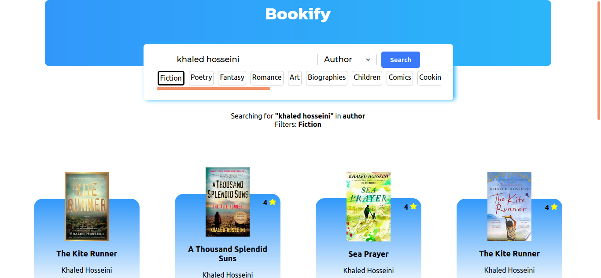

# Bookify

   
  
   

A new way to search for the books you love.
Bookify is a PWA written in React which you lets you search books from millions of collections.

## Features
### Completely Responsive
Gives you the same experience for both web and mobile browsers.

### Apply filters
You can apply filters to search for only the genres you want. 

### Search in different ways
You can search in title, author and publisher.

## Technologies used
Uses React for frontend and uses Google Books API to search and retrieve the list of books.

